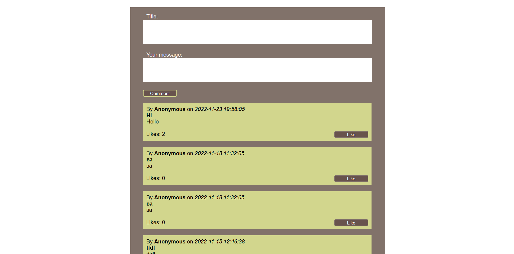
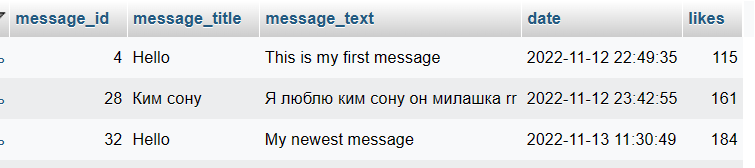

# Отчёт к лабораторной работе №2
## По курсу "Основы программирования"
[Ссылка на репозиторий на github][]

[Ссылка на репозиторий на github]: https://github.com/diffunder/forum-op2/tree/main

## Текст задания
Цель работы - разработать и реализовать клиент-серверную информационную систему, реализующую механизм CRUD
Выполненные требования:
- добавление текстовых заметок в общую ленту
- реагирование на чужие заметки (лайки)
## Пользовательский интерфейс
Главная страница форума

## Пользовательские сценарии работы
1. Пользователь вводит сообщение, но оставляет пустым поле заголовка и пытается отправить комментарий на сайт - на экране появляется сообщение "Please, fill out both boxes to submit your message." и комментарий не выгружается на сайт. 
2. Пользователь вводит сообщение и заголовок, нажимает кнопку "Comment", чтобы отправить комментарий на сайт - комментарий успешно загружается и попадает наверх списка, остальные сообщения сдвигаются вниз.
## Описание API сервера и  его хореографии
Сервер использует HTTP POST запросы для выгрузки комментариев в базу данных.
1. Алгоритм отправки сообщения - после проверки на заполненность полей с заголовком и комментарием в базу данных отправляется запрос, добавляющий комментарий в БД с учётом даты его отправки, текстом заголовка и текстом сообщения. Если проверка пройдена не была, поступит уведомление о необходимости заполнить оба доступных поля.
2. Алгоритм вывода комментариев на экран форума - в базу данных отправляется запрос, по которому берутся 100 последних комментариев, они выводятся на экран в порядке убывания их "message_id", так, что более новые комментарии оказываются сверху.
3. Алгоритм добавления лайка - при нажатии на кнопку "Like" на определённом сообщении страница обновляется и счётчик "Likes: Х", где Х - число лайков, возрастает на единицу.

## Описание структуры базы данных
Для администрирования сервера MySQL и просмотра содержимого базы данных используется браузерное приложение phpMyAdmin. Используется 5 столбцов:
1. "message_id" типа int с автоматическим приращением для выдачи уникальных id каждому сообщению,
2. "message_title" типа text для хранения заголовка комментария, 
3. "message_text" типа text для хранения сообщения комментария,
4. "date" типа datetime для хранения даты и времени отправки сообщения на сайт,
5. "likes" типа int для хранения числа лайков на этом сообщении.

Пример того, как данные пользователей выглядят в базе данных.


## Значимые фрагменты кода
1. Алгоритм отправки комментария в базу данных
```
function setComment() {
    require("connection.php");
    if(isset($_POST['commentSubmit'])) {
            $date = $_POST['date'];
            $title = $_POST['message_title'];
            $message = $_POST['message_text'];
        if (!empty($title) && !empty ($message)) {
            $date = $_POST['date'];
            $title = $_POST['message_title'];
            $message = $_POST['message_text'];
            $query = "INSERT INTO messages (date, message_title, message_text) VALUES ('$date', '$title', '$message')";
            $result = mysqli_query($con, $query);
        }
        else {
            echo "<br><b><div class ='comment'>Please, fill out both boxes to submit your message.</div></b>";
        }
    }
}
```
2. Алгоритм вывода комментариев на сайт
```
function getComments($page_count) {
    require("connection.php");
    $query = "SELECT * FROM messages ORDER BY message_id DESC LIMIT 100";
    $result = mysqli_query($con, $query);
    while ($row = mysqli_fetch_assoc($result)) {   
        echo "<div class='comment'>
            <div> By <b>Anonymous</b> on <i>".$row['date']."</i><br><b>".$row['message_title']."</b></div>
            <div>".$row["message_text"]."</div>
            <div><br>  <form method='POST' action='".likeSubmit($row)."'>  <button type='submit' name='".$row['message_id']."' class='like_button'>Like</button>  Likes: ".$row["likes"]."</form></div>
        </div><br>";
    }
}
```
3. Функция добавления лайка на комментарий
```
function likeSubmit($row) {
    require("connection.php");
    if(isset($_POST[$row['message_id']])) {
        $id = $row['message_id'];
        $likes = $row['likes']+1;
        $query = "UPDATE messages SET likes = '$likes' WHERE message_id = '$id'";
        $result = mysqli_query($con, $query);
        header('Location: index.php');
        exit;
    }
}
```